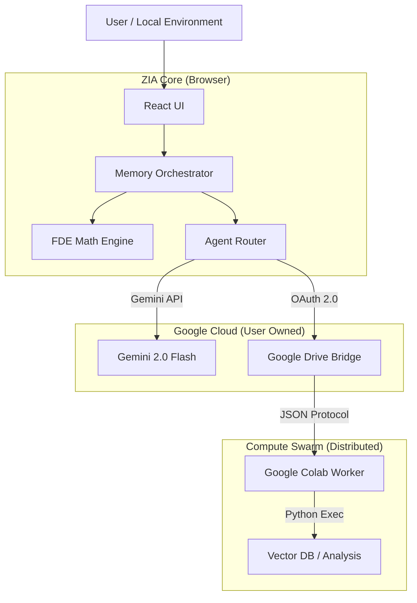

# 🌌 ZIA: HOLON WORLD


> **"Poverty is structural dependency. We build tools for intellectual independence."**

**ZIA (Zero-point Intelligent Agent)** is a **Sovereign Cognitive Operating System** that runs entirely in your browser. Unlike traditional AI wrappers, ZIA does not rely on backend servers to store your memories or execute your logic. Instead, it orchestrates your **Local Resources** (LocalStorage, GPU) and **Personal Cloud** (Google Drive, Colab) to create a "Holon" — a self-sufficient unit of intelligence.

---

## 🏗️ Architecture: The "Zero-Backend" Protocol

ZIA proves that a powerful AI agent can exist without a centralized SaaS backend.



### Key Innovations
1.  **Client-Side RAG via FDE:** Utilizes **MuVERA-inspired Fixed Dimensional Encodings** to perform approximate nearest neighbor search directly in the browser using bitwise operations, bypassing the need for heavy vector DBs for immediate context.
2.  **The Swarm Bridge (Mailbox Pattern):** Overcomes browser CORS and security limitations by using Google Drive as a high-latency message bus to offload heavy Python computation (Data Science, Scraping) to Google Colab.
3.  **Fractal Sandbox:** ZIA can generate, render, and execute its own HTML/JS micro-apps (`ArtifactCanvas`) within a secure iframe, enabling self-evolution of its interface.

---

## ⚡ Features

### 🧠 The Brain: Gemini 2.0 Flash Exp
- **Multi-Modal Reasoning:** Processes text and images for complex problem solving.
- **Grounding:** Real-time access to Google Search for up-to-date information.
- **System 2 Thinking:** Implements "Debate" and "Precise" modes for deep verification.

### 💾 The Memory: Hybrid Topology
- **Identity Layer:** Immutable axioms and core directives.
- **User Context:** Ephemeral working memory.
- **World Knowledge:** Persistent, vector-embedded knowledge base synced to your Google Drive.

### 🦾 The Body: Compute Swarm
- **Python Execution:** seamlessly delegates complex math and data tasks to a Python kernel running on Colab.
- **App Launcher:** Can trigger **JupyterLab** or **n8n** workflows for advanced automation.

---

## 🚀 Getting Started

### Prerequisites
- Node.js 18+
- A Google Cloud Project with **Gemini API** enabled.
- (Optional) Google Drive API enabled for the Swarm Bridge.

### Installation

1.  **Clone the repository**
    ```bash
    git clone https://github.com/your-username/zia-holon-world.git
    cd zia-holon-world
    ```

2.  **Install dependencies**
    ```bash
    npm install
    ```

3.  **Run the development server**
    ```bash
    npm start
    ```

4.  **Open in Browser**
    Visit `http://localhost:1234` (or the port shown in your terminal).

---

## 🎮 Usage Guide

### 1. Basic Setup (The Mind)
1.  Click the **Settings (Gear Icon)** in the top right.
2.  Enter your **Gemini API Key**.
3.  Start chatting! ZIA works as a high-performance local chatbot immediately.

### 2. Enabling the Swarm (The Body)
To enable Python execution and Long-term Memory:
1.  In Settings, click **"Get Worker Script"**.
2.  Open [Google Colab](https://colab.research.google.com/).
3.  Paste the script and run it.
4.  In ZIA Settings, enter your **Google Client ID** and click **"Connect"**.
5.  ZIA is now connected to the Neural Grid.

### 3. Demo Mode (For Judges)
If you don't want to set up Colab:
1.  Open Settings.
2.  Click the **"ENTER DEMO MODE"** button in the "Gemini Competition Mode" banner.
3.  ZIA will simulate the Swarm connection and populate visual graphs with mock data.

---

## 🛠️ Technology Stack

*   **Frontend:** React 18, TypeScript, Tailwind CSS
*   **AI Core:** Google GenAI SDK (`@google/genai`)
*   **Storage:** LocalStorage (Hot), Google Drive (Cold), ChromaDB (Vector)
*   **Compute:** Google Colab (Python Runtime)
*   **Math:** Custom FDE Implementation (SimHash/Bitwise Ops)

---

## 📜 License

This project is licensed under the MIT License - see the [LICENSE](LICENSE) file for details.

---

> Built by **Jonghwan** & **ZIA**.
