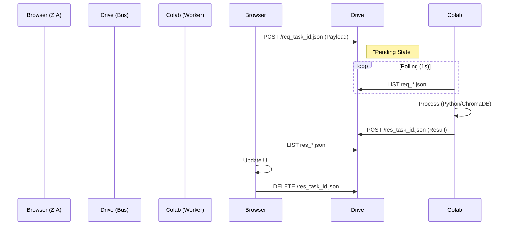

# 02. SYSTEM ARCHITECTURE (BLUEPRINT)

> **Pattern:** Client-Side Orchestration with Hyper-Graph Grid.
> **Constraint:** Zero-Backend (No dedicated server).

## 1. THE STACK
- **Core:** React 18 (Strict Mode).
- **State:** React Hooks + LocalStorage (KV Cache).
- **Brain (LLM):** Gemini 3 Pro Preview / Flash.
- **Hippocampus (Embeddings):** `text-embedding-004` (Google API).
- **Compute:** Google Colab (via Drive Bridge).

## 2. THE OPAL PATTERN (Orchestration of Platforms)
Inspired by the "Opal" architecture, ZIA unifies three Google services into a single "Anti-gravity" engine:
1.  **Drive (Storage):** The persistent file system and message bus.
2.  **Colab (Compute):** The execution runtime for heavy Python/Math tasks.
3.  **n8n (Workflow):** The automation layer connecting external APIs.
ZIA acts as the **Conductor** of this trio, living entirely in the user's browser.

## 3. MEMORY HIERARCHY (The Attention Engine)
The system operates like a Transformer Model extended to the OS level.

1.  **Working Memory (RAM):**
    - The current React State (`messages`).
    - Holds the "Context Window" of the immediate conversation.
2.  **KV Cache (IndexedDB/LocalStorage):**
    - Stores pre-computed Embedding Vectors ($K$) and Contents ($V$).
    - Allows $O(1)$ or $O(N)$ fast vector operations without re-embedding.
3.  **Long-Term Storage (Drive/ChromaDB):**
    - Infinite archival storage.
    - Accessed only when "Attention Score" drops below threshold (Needs deep retrieval).

## 4. THE BRIDGE (MAILBOX PATTERN)
Direct WebSocket is blocked by Colab CSP. We use the **Drive File System** as a high-latency Message Bus.

## 5. SECURITY (ZERO TRUST)
- **Token Handling:** Access Tokens exist ONLY in memory. Never persisted to disk.
- **Isolation:** Python code runs in Colab Sandbox, not on the User's machine.
