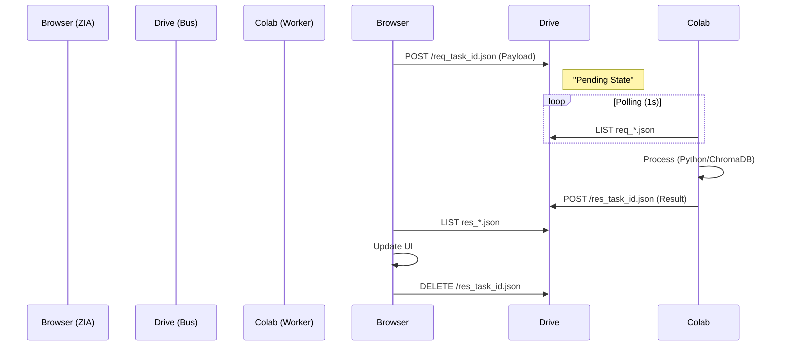

# 02. SYSTEM ARCHITECTURE (BLUEPRINT)

> **Pattern:** Client-Side Orchestration with Hyper-Graph Grid.
> **Constraint:** Zero-Backend (No dedicated server).

## 1. THE STACK
- **Core:** React 18 (Strict Mode).
- **State:** React Hooks + LocalStorage (Persistence).
- **Auth:** Google Identity Services (OAuth 2.0 Client-side).
- **Storage:** Google Drive AppFolder (`_ZIA_HOLON_WORLD`).
- **Compute:** Google Colab (via Drive Bridge).

## 2. THE BRIDGE (MAILBOX PATTERN)
Direct WebSocket is blocked by Colab CSP. We use the **Drive File System** as a high-latency Message Bus.

## 3. MEMORY HIERARCHY
1.  **L1 Cache (React State):** Immediate Context.
2.  **L2 Cache (LocalStorage):** Session persistence.
3.  **L3 Storage (Drive/ChromaDB):** Infinite Vector Store.

## 4. SECURITY (ZERO TRUST)
- **Token Handling:** Access Tokens exist ONLY in memory. Never persisted to disk.
- **Isolation:** Python code runs in Colab Sandbox, not on the User's machine.
